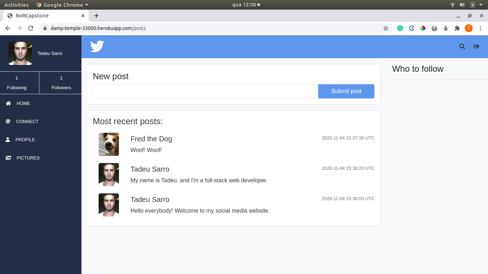

# Ruby Capstone

#### Hello there! This is my Twitter Redesign project. The purpose of this project is to create a MVP of [this](https://www.behance.net/gallery/14286087/Twitter-Redesign-of-UI-details) Twitter redesign.

#### Features
- Create an account and login with `username`
- Follow other users;
- Upload profile photo and cover image;
- See someone's profile, with:
- All their posts;
- Information about the number of posts, followers and following;
- Extra: Filter Users index, by the user `full_name`.

#### Screenshot



#### Livedemo
- [Heroku](https://damp-temple-33000.herokuapp.com/)

## Built With

- [Ruby](https://www.ruby-lang.org)
- [Rails](https://rubyonrails.org/)
- [PostgreSQL](https://www.postgresql.org/)


## Gems
- [Carrierwave](https://github.com/carrierwaveuploader/carrierwave/)
- [Cloudinary](https://github.com/cloudinary/cloudinary_gem/)
- [Database Cleaner](https://github.com/DatabaseCleaner/database_cleaner/)
- [Rails Controller Testing](https://github.com/rails/rails-controller-testing/)
- [Rubocop](https://github.com/rubocop-hq/rubocop/)
- [RSpec Rails](https://github.com/rspec/rspec-rails/)
- [Shoulda Matchers](https://github.com/thoughtbot/shoulda-matchers/)


## Getting started

### Clone

Clone repo with

```
git clone https://github.com/tadeuasarro/RoRCapstone.git
```

### Setup

Install gems with:

```
bundle install
```

Setup database with:
```
   rails db:create
   rails db:migrate
```

### Usage

Start server with:

```
    rails server
```

Open `http://localhost:3000/` in your browser.

### Run tests

```
    bundle exec rspec
```


## Authors

👤 The design belongs to this guy:
- [Gregoire Vella](https://www.behance.net/gallery/14286087/Twitter-Redesign-of-UI-details)

👤 This is me:

- [Tadeu A Sarro](https://tadeuasarro.web.app)


## Contributing

Contributions, issues and feature requests are welcome!

Feel free to check the [issues page](https://github.com/tadeuasarro/RoRCapstone/issues)


## Show your support

Give a star if you like this project!


## Acknowledgments

- Carrierwave
- Cloudinary
- Database Cleaner
- Gregoire Vella
- Microverse
- Rails Controller Testing
- Rubocop
- RSpec Rails
- Shoulda Matchers


## 📝 License

This project is MIT licensed.
